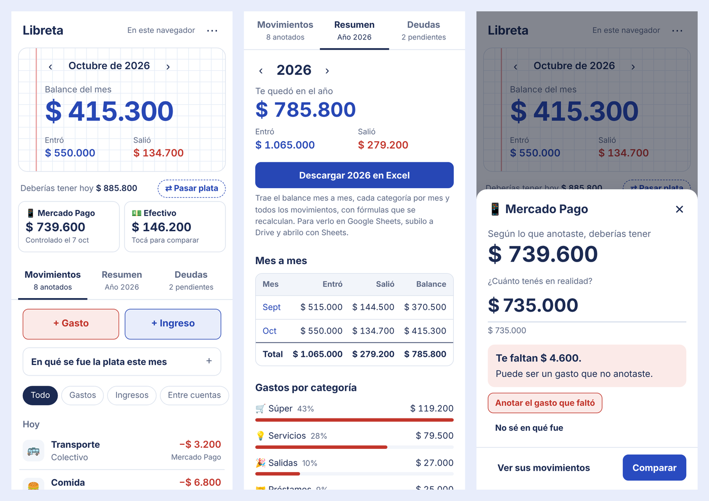

# 📒 Libreta de cuentas

App web para controlar ingresos, gastos y deudas desde el celular. Se instala como una app, funciona sin conexión y **los datos nunca salen del dispositivo**.

**▶ Probala:** https://alanvillar05.github.io/control-de-gastos/



## Funcionalidades

- **Ingresos y gastos** con categorías propias (nombre e ícono), que se crean desde el mismo formulario.
- **Varias cuentas** (Mercado Pago, efectivo y las que agregues), con el saldo que deberías tener y pases de plata entre cuentas que no cuentan como ingreso ni como gasto.
- **Control contra el saldo real:** ingresás cuánto tenés de verdad y la app te dice si falta o sobra plata, y te ayuda a anotar la diferencia.
- **Deudas:** lo que debés y lo que te deben, con pagos parciales y vencimientos. Si pusiste plata vos, se descuenta de la cuenta y vuelve a entrar al registrar el cobro.
- **Resumen anual** mes a mes y por categoría, con **exportación a Excel** (las fórmulas se recalculan si editás la planilla).
- **Copia de seguridad** en `.json`, restauración y botón de deshacer al borrar.
- Modo oscuro automático e instalación en la pantalla de inicio.

## Privacidad

No hay servidor ni base de datos compartida. Cada persona guarda lo suyo en el almacenamiento de su navegador (`localStorage`), así que nadie más puede verlo. La contra: si se borran los datos del navegador, se pierde lo anotado, por eso conviene descargar una copia de seguridad cada tanto desde **⋯ › Descargar copia de seguridad**.

## Decisiones técnicas

| Decisión | Por qué |
|---|---|
| Montos guardados en **centavos enteros** | En JavaScript `0.1 + 0.2` da `0.30000000000000004` (coma flotante). Con enteros, las sumas de plata son exactas. |
| HTML, CSS y JavaScript **en un solo archivo, sin frameworks** | No necesita compilación: se publica tal cual y es fácil de mantener. |
| Categorías y cuentas referenciadas **por id**, no por nombre | Renombrar una categoría actualiza todo el historial sin romper nada. |
| **PWA** (*Progressive Web App*) con *service worker* "red primero" | Con internet siempre carga la última versión publicada; sin conexión usa la copia guardada. |
| **ExcelJS** cargado solo al exportar | La app abre rápido; la librería se descarga únicamente cuando hace falta. |

## Estructura

| Archivo | Para qué sirve |
|---|---|
| `index.html` | La app completa. |
| `manifest.webmanifest` | Nombre, colores e íconos para instalarla como app. |
| `sw.js` | *Service worker*: permite abrirla sin conexión. |
| `icon-192.png`, `icon-512.png`, `apple-touch-icon.png` | Íconos de la app. |
| `capturas/` | Imágenes de este README. |
| `.github/workflows/publicar.yml` | Publica `main` y `dev` (en `/beta/`) en GitHub Pages en cada push. |
| `.nojekyll` | Evita el procesamiento con Jekyll si alguna vez se publica directo desde una rama. |

## Probarla en la compu

El *service worker* no funciona abriendo el archivo con doble clic (`file://`), así que hay que servirla con un servidor local:

```bash
python3 -m http.server 8000
```

Y abrir http://localhost:8000.

## Cómo se trabaja: ramas y versión de prueba

| Rama | Se publica en | Para qué |
|---|---|---|
| `main` | https://alanvillar05.github.io/control-de-gastos/ | Versión estable, la que usa todo el mundo. |
| `dev` | https://alanvillar05.github.io/control-de-gastos/beta/ | Versión de prueba para revisar los cambios antes de lanzarlos. |

1. Los cambios se hacen y se suben a `dev`. El workflow `.github/workflows/publicar.yml` los publica en `/beta/` en unos minutos.
2. Se prueban en la beta. Lo que se anota ahí se guarda aparte, así que no toca los datos reales.
3. Si está todo bien, se abre un *pull request* de `dev` a `main` y se acepta (*merge*). Esa es la versión que les llega a todos la próxima vez que abran la app con internet.

Cada versión nueva sube el número de `VERSION` en `index.html` y agrega una entrada en `NOVEDADES`: la app se las muestra a cada persona una sola vez después de actualizar. Si se modifican `sw.js`, el manifest o los íconos, también hay que subir el número de `CACHE` en `sw.js` para que los celulares descarten la copia vieja.

> GitHub Pages tiene que estar configurado con **Settings › Pages › Source: GitHub Actions**.

## Limitaciones conocidas

- Los datos no se sincronizan entre dispositivos: cada navegador tiene su propia libreta. Para pasarlos de uno a otro, usar la copia de seguridad.
- Exportar a Excel requiere conexión, porque la librería se descarga en ese momento.

## Licencia

[MIT](LICENSE) © [alanvillar05](https://github.com/alanvillar05)
